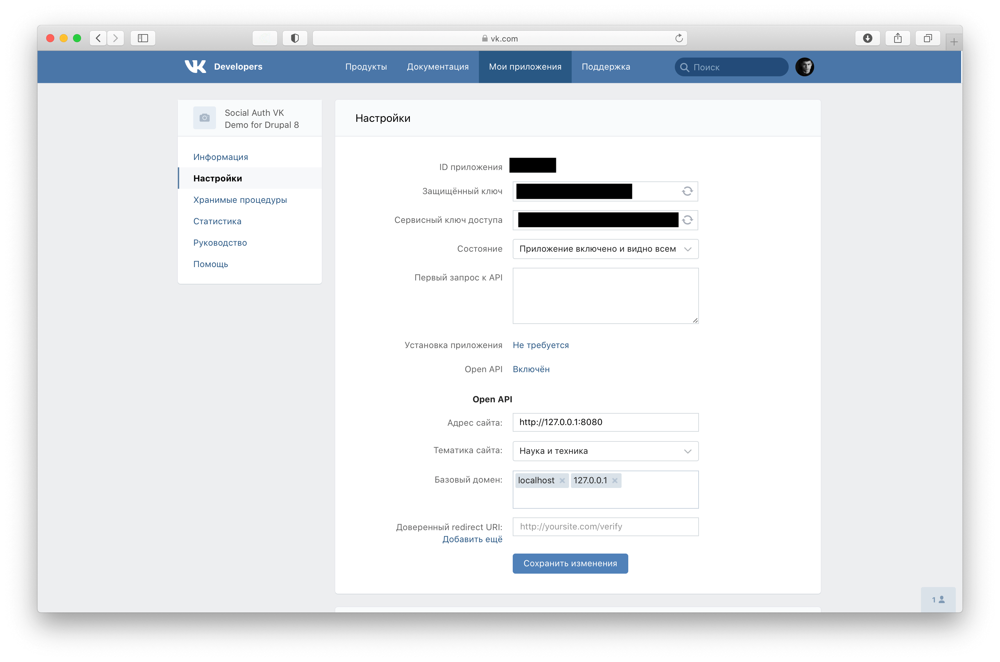
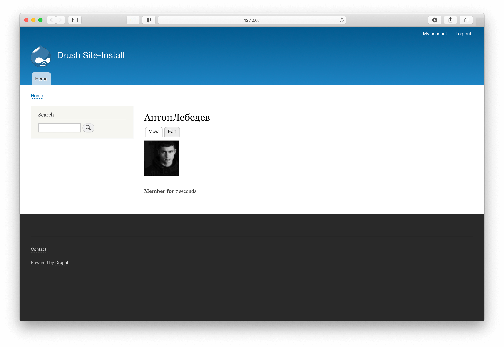

# Drupal 8: Social Auth Vk Demo

Demo Drupal 8 installation to demonstrate the [Social Auth Vkontake module](https://www.drupal.org/project/social_auth_vk).

## Installation

Clone the repo, go to project folder and run `composer install`.

## Usage

1. Go to https://vk.com/apps?act=manage to create a new application and obtain application id and secret key.



2. Copy `.env.example` file to `.env` at root of this project. Provide the `VK_CLIENT_ID` and `VK_CLIENT_SECRET`.

3. To start a server, run the following command:

```
./vendor/bin/drush runserver 127.0.0.1:8080
```

4. Go to http://127.0.0.1:8080 and try to login via Vkontakte.



To login as drupal admin use `admin` with password `admin`.
